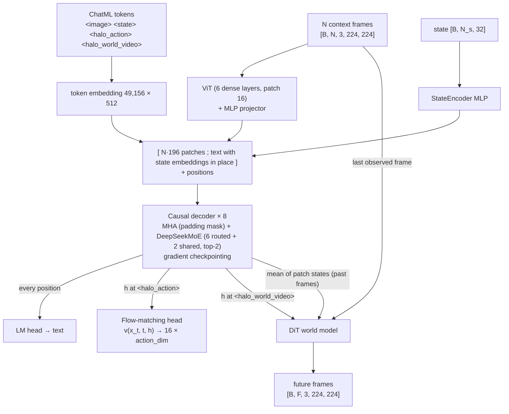
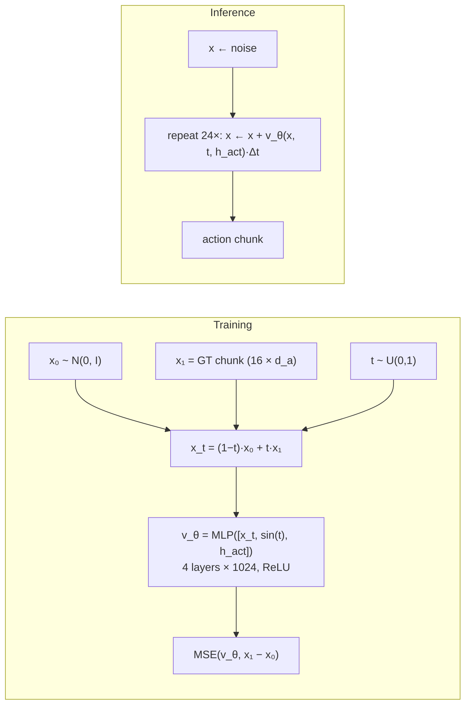
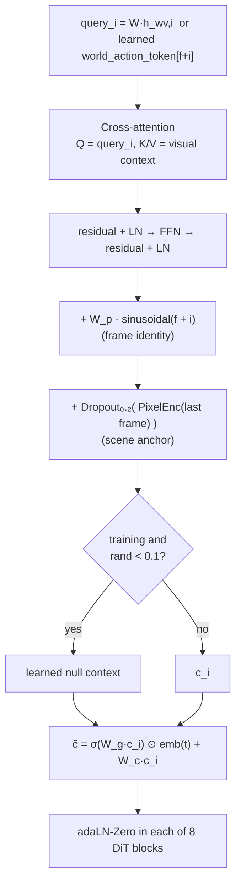
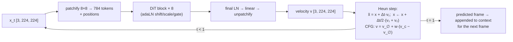
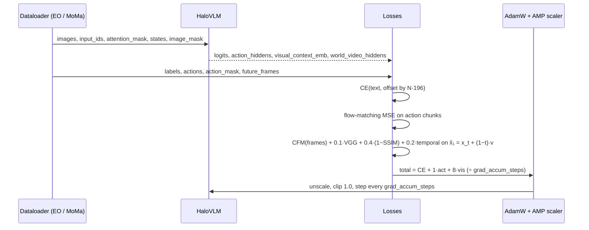

# Architecture

All diagrams are Mermaid and render on GitHub. They match Section 3 of the
[paper](../paper/main.tex) and the [project page](../project-page/index.html). For
implementation detail on the world model, see [world_model.md](world_model.md).

## 1. System overview: perceive, reason, act, imagine

## 2. Flow-matching action head

## 3. Per-frame conditioning for the DiT world model

## 4. DiT denoiser and sampler

## 5. Training step and losses

## Parameter budget (default config, measured)

| Module | Params |
|---|---|
| ViT | 10.0M |
| Image projector | 0.23M |
| Token embedding | 25.2M |
| Position embedding | 1.0M |
| Decoder (MoE) | 68.8M |
| LM head | 25.2M |
| State encoder | 0.40M |
| Flow-matching head | 3.0M |
| DiT world model | 42.5M |
| **Total** | **176.3M** |
