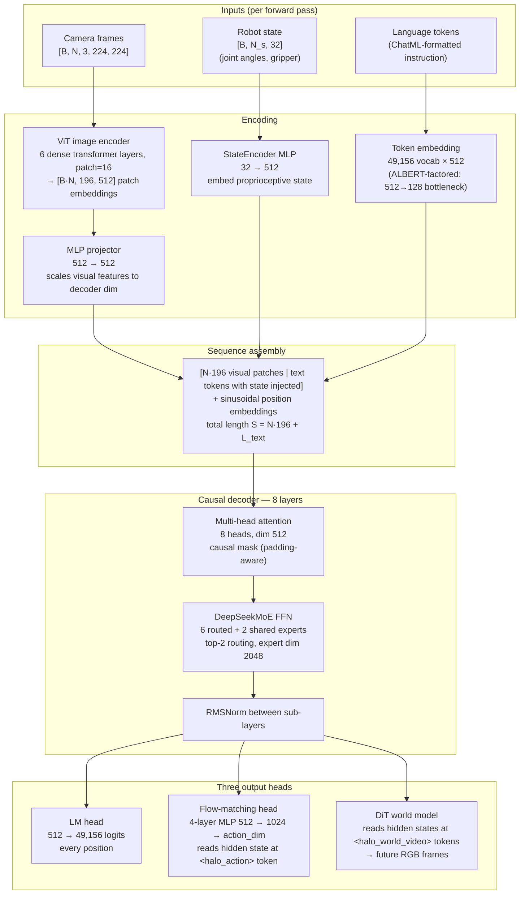
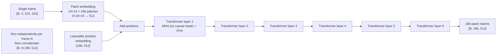
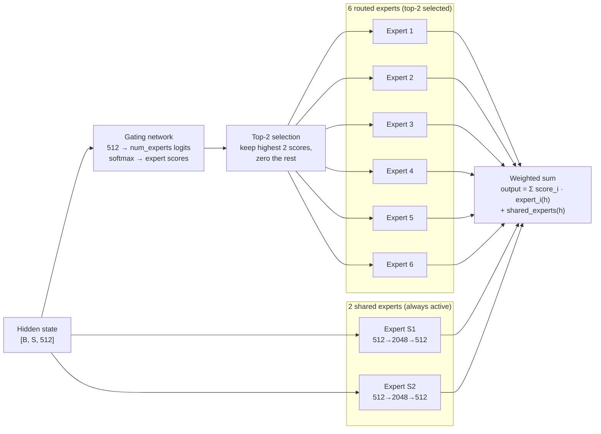
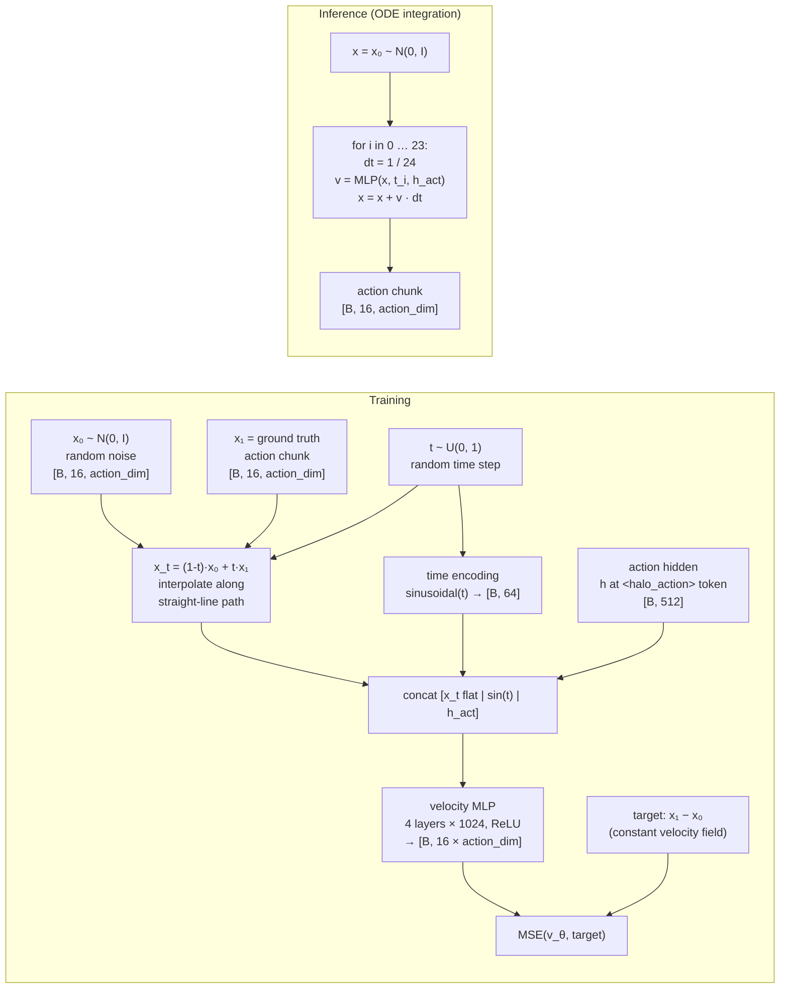
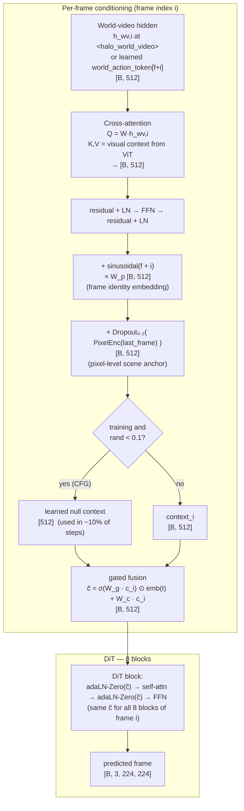
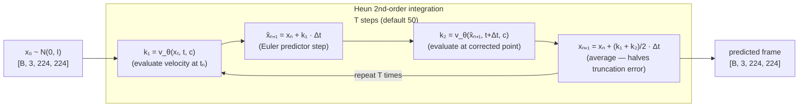
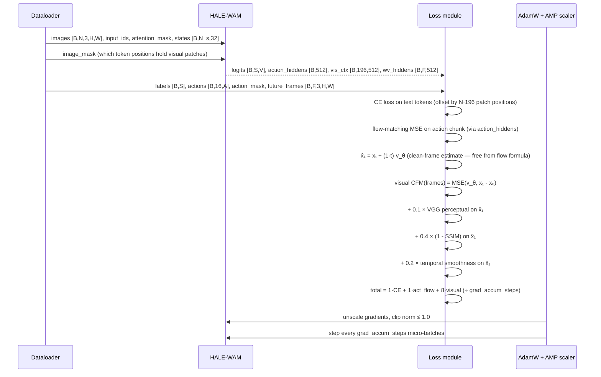
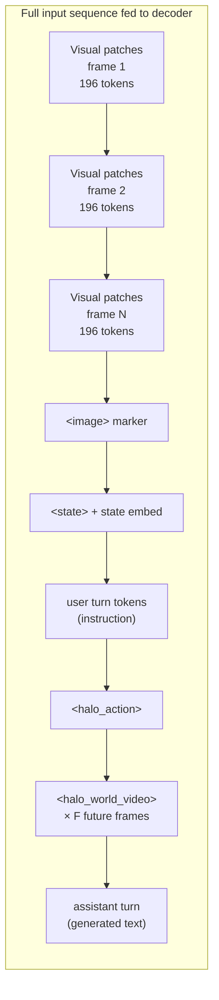

# Architecture

Mermaid diagrams (render on GitHub). They match Section 3 of the
[paper](../paper/main.tex) and the [project page](../project-page/index.html).
For the world model implementation details, see [world_model.md](world_model.md).

---

## 1. End-to-end overview

One causal decoder reads camera patches, proprioceptive state, and language tokens — then three independent heads read specific hidden states to produce text, actions, and future frames.

---

## 2. Vision encoder detail (ViT)

---

## 3. DeepSeekMoE expert routing

---

## 4. Flow-matching action head

The velocity MLP learns a straight-line trajectory in action space from noise to the ground-truth chunk.

---

## 5. DiT world model — per-frame conditioning

Each future frame gets a unique conditioning vector built from four stacked signals, which modulates every DiT block via adaLN-Zero.

---

## 6. Heun sampler (ODE integration for world model)

---

## 7. Training step (all losses combined)

---

## 8. Token sequence layout

LM loss is applied only to `AST` tokens. The `<halo_action>` hidden state feeds the flow-matching head; `<halo_world_video>` hidden states feed the DiT.
