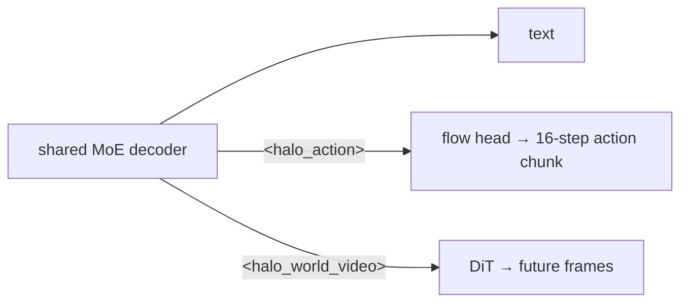

# Teaching a robot policy to imagine: inside HALE-WAM

*2026-09-28 · B A NaveenKumar*

> **Summary.** HALE-WAM is a 176M-parameter model that looks at a few camera frames, says
> what it's going to do, samples an action trajectory with flow matching, and draws what
> the scene will look like next with a Diffusion Transformer, all from one transformer.
> This post explains how the pieces fit and which tricks made the imagined frames usable.

## Perceive, reason, act, imagine

A normal VLA stops at "act". HALE-WAM adds "imagine" for two reasons:

1. **Inspectability.** If the model says "pull the chain to turn off the light" and its
   imagined next frame shows the lamp going dark, you can see that the plan makes sense.
2. **Dense supervision.** Video frames carry a lot more signal than a 16-step action chunk,
   and they're available even when action labels are noisy or missing.

## One backbone, four tokens, three heads

Everything goes through a single 8-layer causal transformer with DeepSeek-style MoE
feed-forward layers. Four special tokens decide what gets read out where:

| Token | Role |
|---|---|
| `<image>` | frame → ViT → 196 patch embeddings, prepended |
| `<state>` | proprioception → MLP, written in place |
| `<halo_action>` | its hidden state conditions the **flow-matching action head** |
| `<halo_world_video>` | its hidden state is the query for one **predicted frame** |

## Acting with flow matching

Instead of regressing one action, the action head learns a **velocity field** that carries
Gaussian noise to the action chunk along a straight line:

- training: `x_t = (1−t)·noise + t·action`, target velocity `action − noise`;
- inference: start from noise and take 24 Euler steps along `v_θ(x, t, h_action)`.

This can represent "go left **or** right around the obstacle" instead of averaging the
two into "go straight". There is a longer, standalone explanation in the
[flow-matching post](../../flow_blog.md).

## Imagining with a DiT

The world model is a Diffusion Transformer trained with the same flow-matching objective,
directly on 224×224 pixels (patch 8, so 784 tokens). The hard part isn't the denoiser. It's
**conditioning**. If all future frames share a similar conditioning vector, they collapse
into the same blurry image. HALE-WAM stacks four signals into each frame's conditioning
vector:

1. **A query** from the decoder (the `<halo_world_video>` hidden state), cross-attending to
   the visual context. This carries the semantics of *what should happen*.
2. **A sinusoidal frame index**, so frame 3 can never be confused with frame 1.
3. **A pixel encoding of the last observed frame**, a cheap version of the context-frame
   conditioning in Stable Video Diffusion. It anchors colours and layout.
4. **Classifier-free guidance dropout**: 10% of the time the whole vector is replaced by a
   learned null token, so at inference you can push the prediction toward the condition.

Inside the DiT, the context doesn't just get added to the timestep embedding. It
**gates** it: `σ(W·c) ⊙ emb(t) + W'·c`. Without the gate, the timestep signal tends to swamp
the conditioning.

## Fighting blur

Pixel-space velocity MSE is an average over plausible futures, and averages are blurry.
Because the flow is a straight line, the model's clean-frame estimate comes out in closed
form, `x̂₁ = x_t + (1−t)·v_θ`, so we can apply image losses to it:

- **VGG perceptual loss** (relu1_2 and relu2_2),
- **SSIM** with an 11×11 Gaussian window,
- **temporal smoothness** between consecutive frames' velocity fields.

Sampling uses **Heun's method** (a predictor–corrector step) instead of Euler. It halves
the truncation error for the same number of model calls per step, and it must never query
the model at exactly `t = 1`, which is one of the six bugs documented in
[world_model.md](../world_model.md).

## What it looks like today

In the GIF at the top (training step 24,000, AIRoA MoMa), the language head reproduces the
target response and the imagined fifth frame gets the *event* right: the lamp is dark after
the chain is pulled. It also shows what's still missing. The frame is over-contrasted and
shows 8×8 patch artefacts, and the action curves follow the overall range but not every
high-frequency dimension. This is one qualitative sample, not a benchmark.

## What's next

- Move the DiT into the latent space of the included `VideoVAE`, for sharper frames at
  lower cost.
- Temporal attention across predicted frames.
- Depth and optical-flow heads (their config fields are already there).
- Quantitative evaluation: action error on held-out episodes, PSNR/SSIM/LPIPS against
  horizon, and ablations of each conditioning signal.

Code, paper and diagrams: [github.com/basaanithanaveenkumar/HALE-WAM](https://github.com/basaanithanaveenkumar/HALE-WAM).
